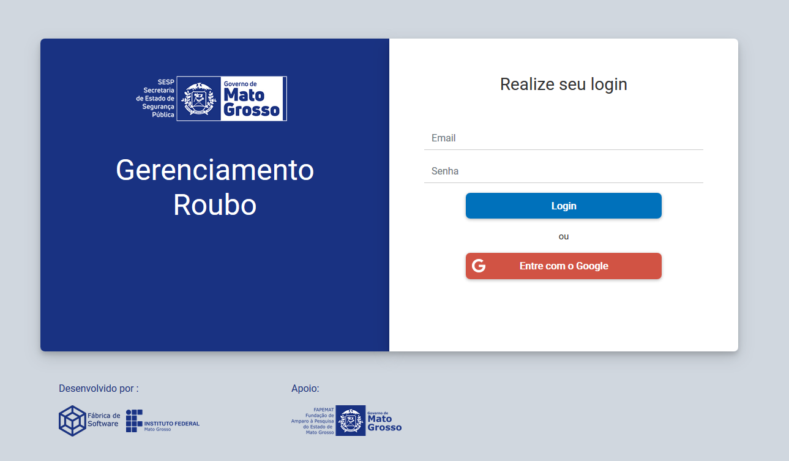
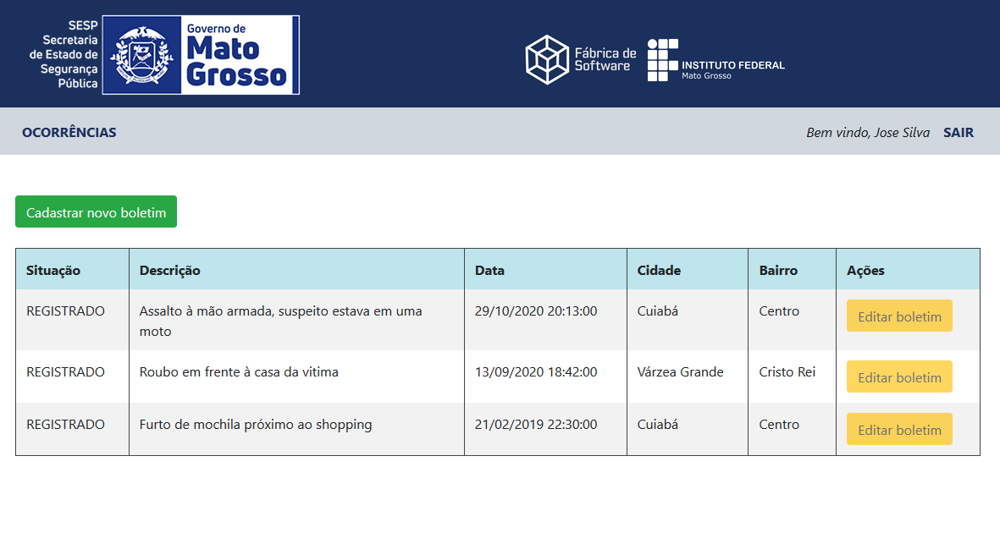
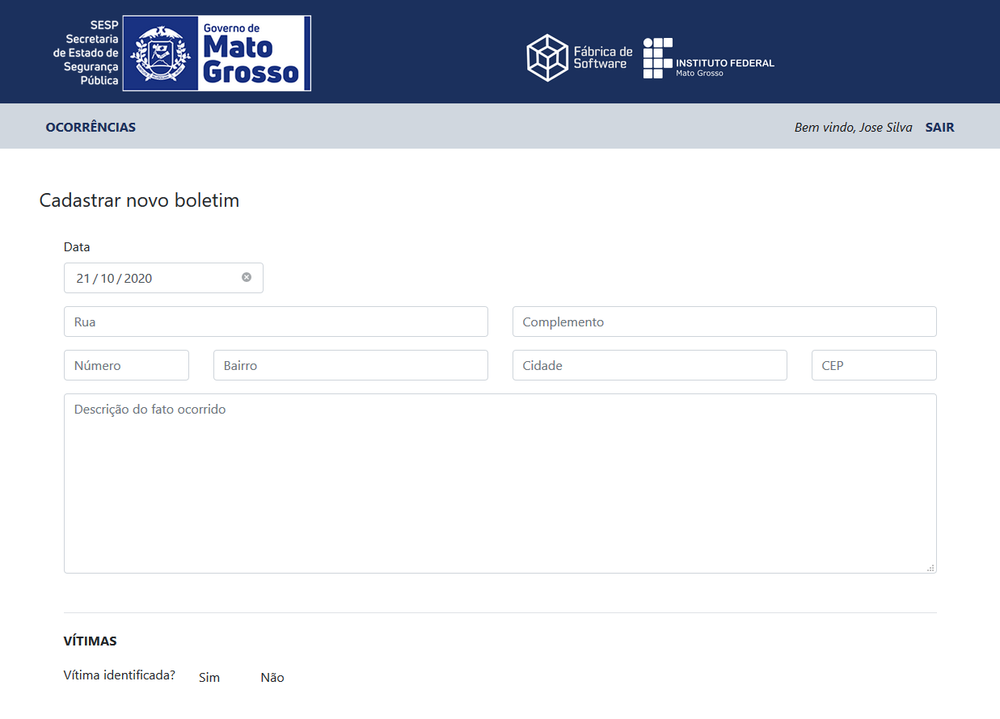

# Gerenciamento Roubo Web
Projeto Angular para interface gráfica web do processo de roubo de veículo do protótipo funcional.

# Tecnologias utilizadas

| Tecnologia | Versão | Descrição                                        |
| ---------- | ------ | ------------------------------------------------ |
| Node.js    | 14.x.x | Ambiente de execução JavaScript                  |
| Angular    | 10.1.x | Framework para desenvolvimento de aplicações web |
| Typescript | 4.0.3  | Superset transpilador para JavaScript            |
| npm        | 6.14.x | Gerenciador de pacotes do Node                   |
| Bootstrap  | 4.5.x  | Framework css                                    |

# Microsserviços utilizados
| Repositório do Gitlab                                                           |
| ------------------------------------------------------------------------------- |
| [Registro Geral](https://gitlab.com/sesp-mt/registro-geral)                     |
| [Autenticação](https://gitlab.com/sesp-mt/autenticacao)                         |
| [Gerenciamento Procurado](https://gitlab.com/sesp-mt/gerenciamento-procurado)   |
| [Gerenciamento Ocorrência](https://gitlab.com/sesp-mt/gerenciamento-ocorrencia) |


# Build local
Para realizar o *build* local é necessário fazer a instalação de todos os pacotes com o comando ```npm install```.
Após isso deve-se executar o comando ```npm run start``` para executar o servidor local do _Angular_, ainda é necessário utilizar o projeto 
[setup](https://gitlab.com/sesp-mt/setup) para inicializar os microsserviços.

# Build com *Docker*

#### Execute o arquivo `build.sh` para criar a imagem da aplicação:

```shell
sh build.sh
```

_Esse build manual é opcional, o projeto [setup](https://gitlab.fabricadesoftwareifmt.com.br/sesp-mt/setup) possui um 
script para automatizar o build e inicialização do container._

#### Inicialização da aplicação:

O projeto `Gerenciamento Roubo Web` consome os microsserviços externos, assim, para facilitar a automação da inicialização
foi criado o projeto [setup](https://gitlab.fabricadesoftwareifmt.com.br/sesp-mt/setup) que possui a responsabilidade de
iniciar a execução de todos os containers utilizados por este projeto.

Assim, utilize o arquivo `docker-compose.yml` localizado no projeto [setup](https://gitlab.fabricadesoftwareifmt.com.br/sesp-mt/setup)
para iniciar todos os microsserviços e a aplicação web com o seguinte comando:

```
docker-compose up -d
```


# Aplicação
## Tela de login

## Listagem de boletins

## Tela de cadastro de boletim

